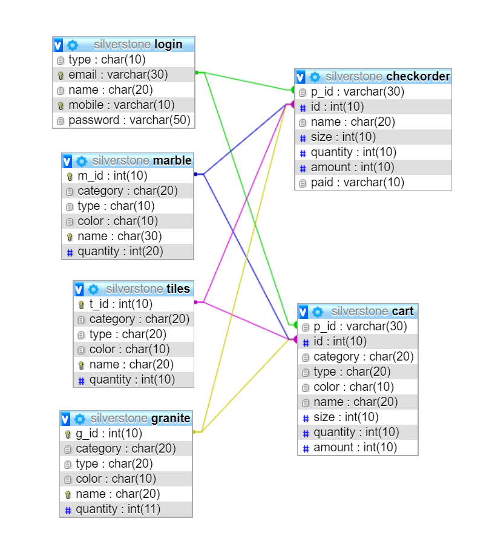

# SilverStone---Online-Shop-web-Application-
Web Application for online stone(marble,granite,tiles) ordering..
## Introduction
The Project entitled "SILVERSTONE Online Shop" is a web-based application Software developed in Python and MySQL using, HTML, JavaScript, jQuery as front end and backend using MySQL. The main aim of "Online Shop" is to improve the services of Customers. It maintains the details of product, addition of new customers, and also updating, for the same. It also updates the details of products generated by customer. The primary features of the project entitled "ONLINE SHOP" are high accuracy, design flexibility and easy availability. And also it uses database tables Representing entities and relationships between entities.
## Software Requirements
Operating System		  :	Windows/Linux
User Interface			  :	HTML5, CSS
Programming Language	:	Python,Flask
Database			        : MYSQL(XAMPP)
## Software Features
### Python Flask
Flask is a web framework. This means flask provides you with tools, libraries and technologies that allow you to build a web application. This web application can be some web pages, a blog, a wiki or go as big as a web-based calendar application or a commercial website.
Flask is part of the categories of the micro-framework. Micro-framework are normally framework with little to no dependencies to external libraries. This has pros and cons. Pros would be that the framework is light, there are little dependency to update and watch for security bugs, cons is that some time you will have to do more work by yourself or increase yourself the list of dependencies by adding plugins.
## ER-Diagram(Architecture)
 

